#### Luồng 1: Tạo tài khoản pending, xác thực email, đăng nhập

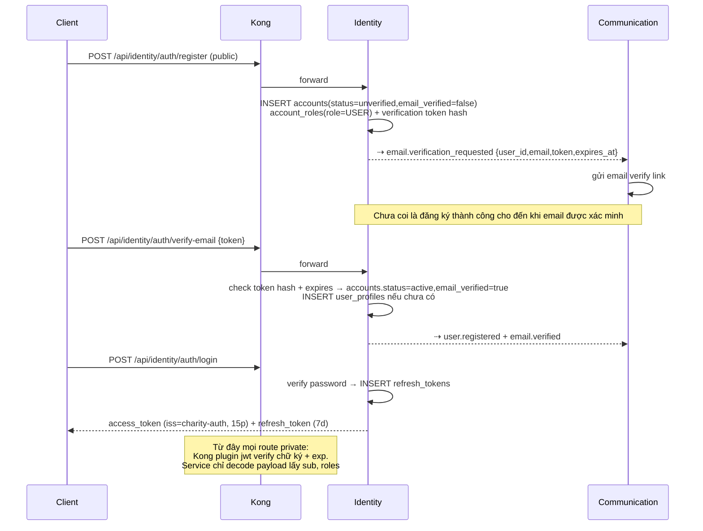

- **Refresh**: `POST /api/identity/auth/refresh` → verify hash trong `refresh_tokens`, rotate (revoke cũ, cấp mới)
- **Quên mật khẩu**: `forgot-password` → publish `password.reset_requested` để Communication gửi link reset; `reset-password` nhận token link.
- **Role lưu ý**: Identity chỉ quản lý role toàn hệ thống (`USER`, `PLATFORM_ADMIN`). Role trong nhóm như `owner/moderator/member` thuộc Community `group_members` và được kiểm tra theo từng group.

#### Luồng 2: Tạo nhóm, xin tham gia, duyệt thành viên

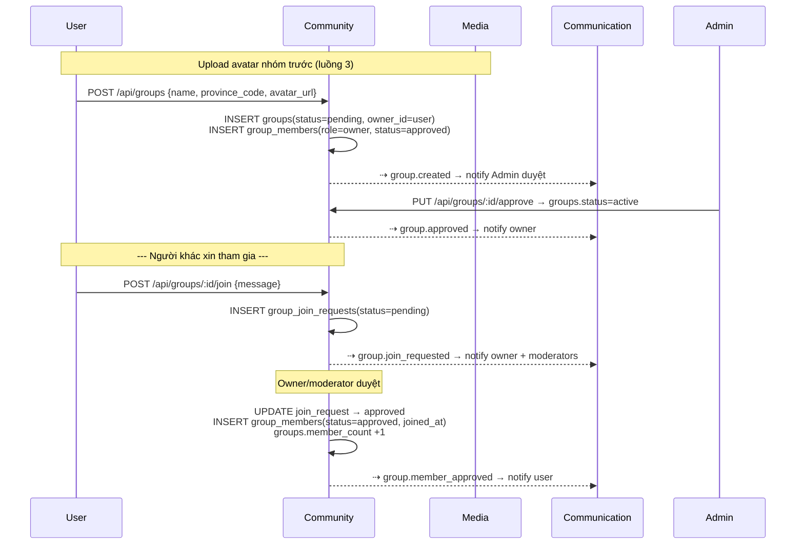

Đổi role moderator: `PUT /api/groups/:id/members/:uid/role` (chỉ owner). Kick/ban: cập nhật `group_members.status=banned`.

#### Luồng 3: Upload ảnh (dùng chung mọi nơi)

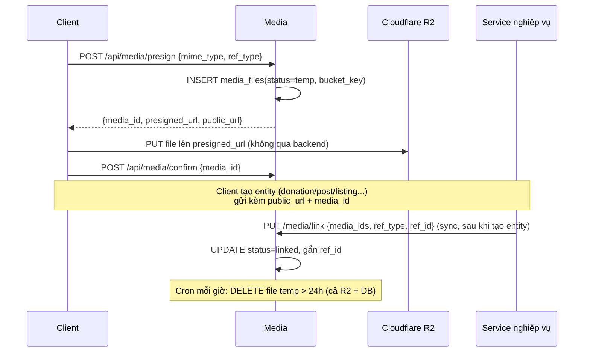

#### Luồng 4: Quyên góp - từ đăng ký đến nhập kho (luồng lõi 1)

Donor **không cần là member** của nhóm (đã chốt).

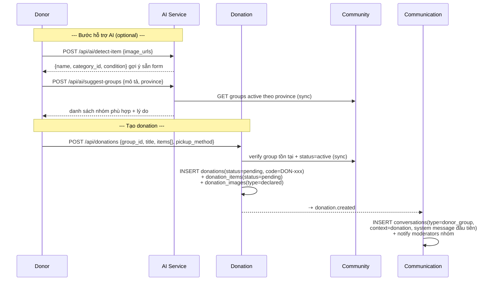

**Nhóm xử lý — 3 bước trạng thái:**

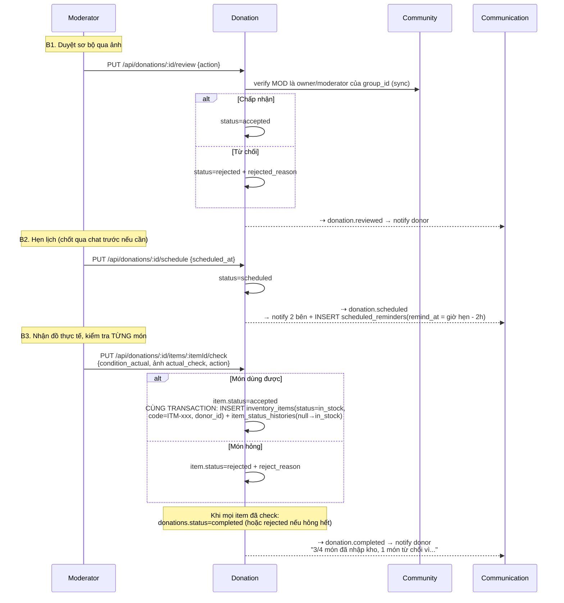

Điểm quan trọng: check → nhập kho là **một transaction nội bộ** Donation Service (Donation + Inventory chung DB), không có rủi ro mất đồng bộ.

#### Luồng 5: Đăng gian hàng 0 đồng (luồng lõi 2)

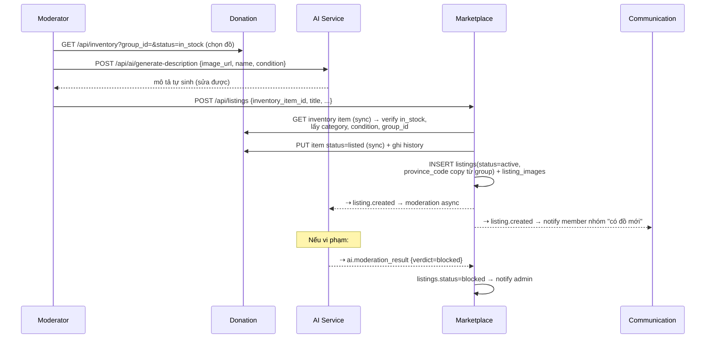

#### Luồng 6: Đăng ký nhận đồ → xét duyệt → trao tặng (luồng lõi 3)

Receiver **bắt buộc là member approved** của nhóm.

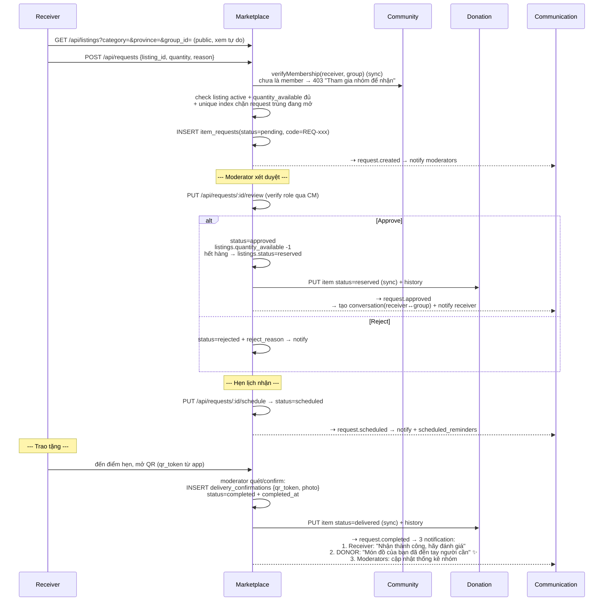

Trường hợp phụ: receiver không đến (`no_show`) hoặc hủy (`cancelled`) → hoàn `quantity_available +1`, item về `in_stock`, listing về `active`.

#### Luồng 7: Chat realtime (shared inbox phía nhóm)

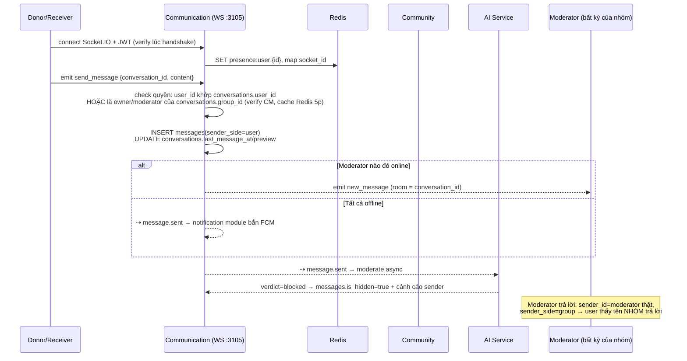

#### Luồng 8: Đánh giá sau giao dịch

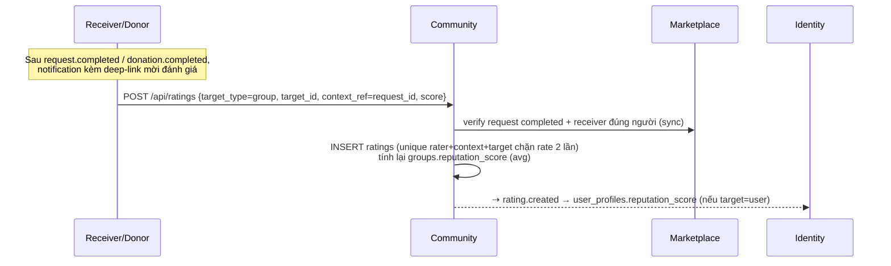

Chiều ngược lại: nhóm đánh giá donor (đồ đúng mô tả không) với `context_ref=donation_id`.

#### Luồng 9: Báo cáo vi phạm → xử lý

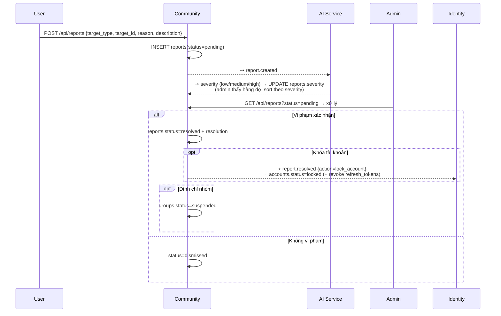

#### Luồng 10: Bài viết trong nhóm (feed)

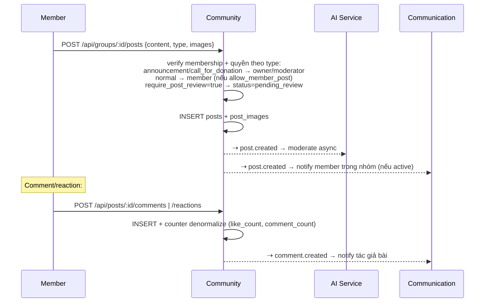

#### Luồng 11: Notification + nhắc lịch (chạy ngầm)

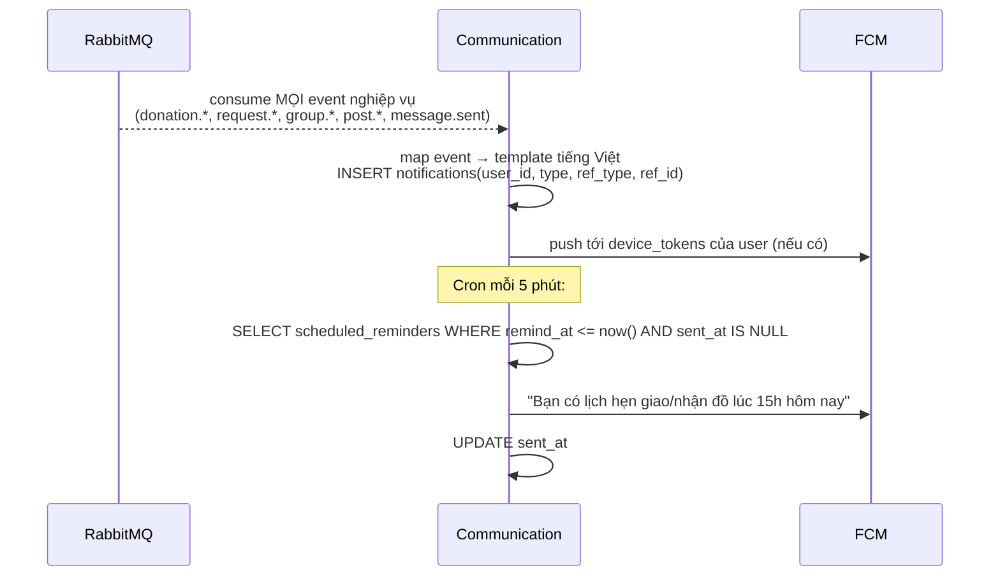

#### Luồng 12: Analytics (module trong Marketplace)

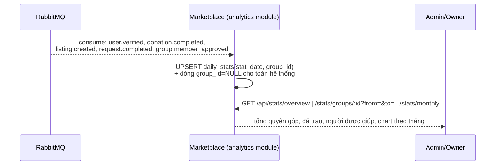

#### Luồng 13: Hành trình món đồ (minh bạch cho donor)

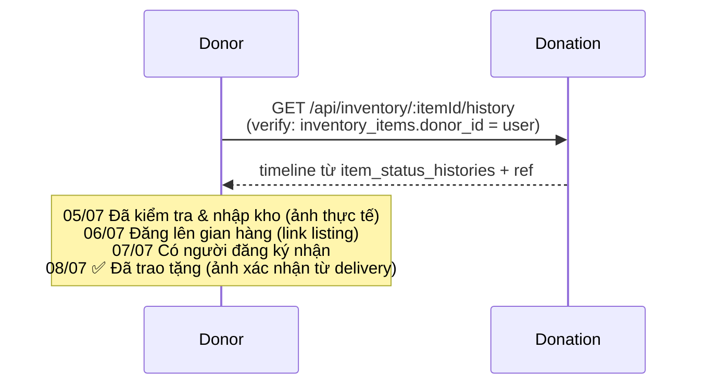

#### Bảng tổng hợp chuỗi trạng thái xuyên suốt

```text
DONATION:  pending → accepted → scheduled → completed (hoặc rejected/cancelled)
ITEM (kho): in_stock → listed → reserved → delivered (hoặc discarded)
LISTING:   active → reserved → closed (hoặc blocked)
REQUEST:   pending → approved → scheduled → completed (hoặc rejected/cancelled/no_show)

Sync (client lib):  Marketplace→Community (membership), Marketplace→Donation (item),
                    Donation→Community (group/role), AI→Community (groups)
Event (RabbitMQ):   mọi thay đổi trạng thái → Communication (notify) + Analytics (stats)
                    post/listing/message.created → AI (moderation)
```
