# Luồng nghiệp vụ cross-service

> **Mục đích từng service + API chi tiết:** xem [services/README.md](./services/README.md).  
> File này tập trung **sequence diagram** xuyên nhiều service.

#### Luồng 1: Tạo tài khoản pending, xác thực email, đăng nhập

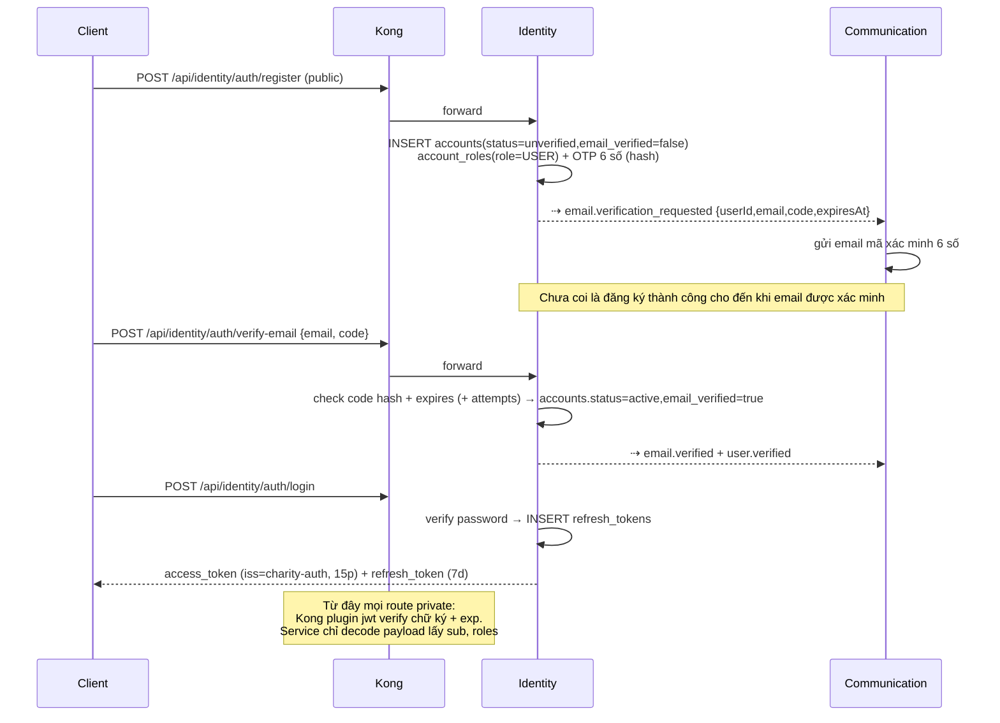
```mermaid
sequenceDiagram
    participant C as Client
    participant K as Kong
    participant ID as Identity
    participant COM as Communication
    C->>K: POST /api/identity/auth/register (public)
    K->>ID: forward
    ID->>ID: INSERT accounts(status=unverified,email_verified=false)<br/>account_roles(role=USER) + OTP 6 số (hash)
    ID-->>COM: ⇢ email.verification_requested {userId,email,code,expiresAt}
    COM->>COM: gửi email mã xác minh 6 số
    Note over ID,COM: Chưa coi là đăng ký thành công cho đến khi email được xác minh
    C->>K: POST /api/identity/auth/verify-email {email, code}
    K->>ID: forward
    ID->>ID: check code hash + expires (+ attempts) → accounts.status=active,email_verified=true
    ID-->>COM: ⇢ email.verified + user.verified
    C->>K: POST /api/identity/auth/login
    ID->>ID: verify password → INSERT refresh_tokens
    ID-->>C: access_token (iss=charity-auth, 15p) + refresh_token (7d)
    Note over K: Từ đây mọi route private:<br/>Kong plugin jwt verify chữ ký + exp.<br/>Service chỉ decode payload lấy sub, roles
```

- **Refresh**: `POST /api/identity/auth/refresh` → verify hash trong `refresh_tokens`, rotate (revoke cũ, cấp mới)
- **Quên mật khẩu (3 bước)**:
  1. `POST /auth/forgot-password {email}` → OTP 6 số + email
  2. `POST /auth/verify-reset-code {email, code}` → `{reset_token, expires_in}` (session ~10m)
  3. `POST /auth/reset-password {reset_token, new_password}` (hoặc one-shot `{email, code, new_password}`)
- **Đăng ký trùng email/phone unverified (reclaim)**: nếu account đã tồn tại nhưng **chưa verify**, `POST /register` **ghi đè** password + `full_name` (và phone nếu gửi), phát OTP mới — **không** 409, **không** cần TTL 24h. Email/phone đã verify vẫn **409**.
- **Role lưu ý**: Identity chỉ quản lý role toàn hệ thống (`USER`, `PLATFORM_ADMIN`). Role trong nhóm như `owner/moderator/member` thuộc Community `group_members` và được kiểm tra theo từng group.

#### Luồng 2: Tạo nhóm, xin tham gia, duyệt thành viên

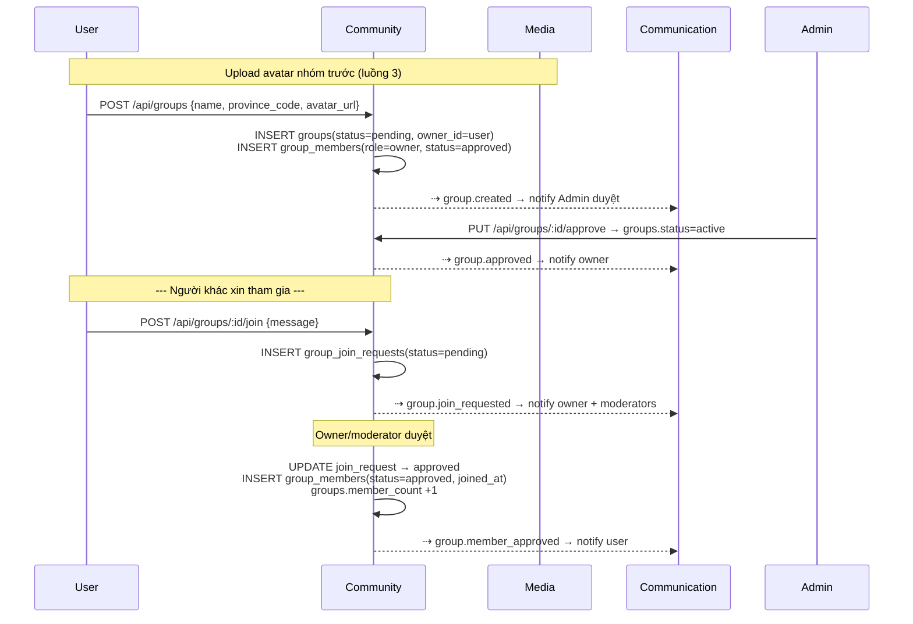
```mermaid
sequenceDiagram
    participant U as User
    participant CM as Community
    participant M as Media
    participant COM as Communication
    participant AD as Admin
    Note over U,M: Upload avatar nhóm trước (luồng 3)
    U->>CM: POST /api/groups {name, province_code, avatar_url}
    CM->>CM: INSERT groups(status=pending, owner_id=user)<br/>INSERT group_members(role=owner, status=approved)
    CM-->>COM: ⇢ group.created → notify Admin duyệt
    AD->>CM: PUT /api/groups/:id/approve → groups.status=active
    CM-->>COM: ⇢ group.approved → notify owner
    Note over U,CM: --- Người khác xin tham gia ---
    U->>CM: POST /api/groups/:id/join {message}
    CM->>CM: INSERT group_join_requests(status=pending)
    CM-->>COM: ⇢ group.join_requested → notify owner + moderators
    Note over CM: Owner/moderator duyệt
    CM->>CM: UPDATE join_request → approved<br/>INSERT group_members(status=approved, joined_at)<br/>groups.member_count +1
    CM-->>COM: ⇢ group.member_approved → notify user
```

Đổi role moderator: `PUT /api/groups/:id/members/:uid/role` (chỉ owner). Kick/ban: cập nhật `group_members.status=banned`.

#### Luồng 3: Upload ảnh (dùng chung mọi nơi)

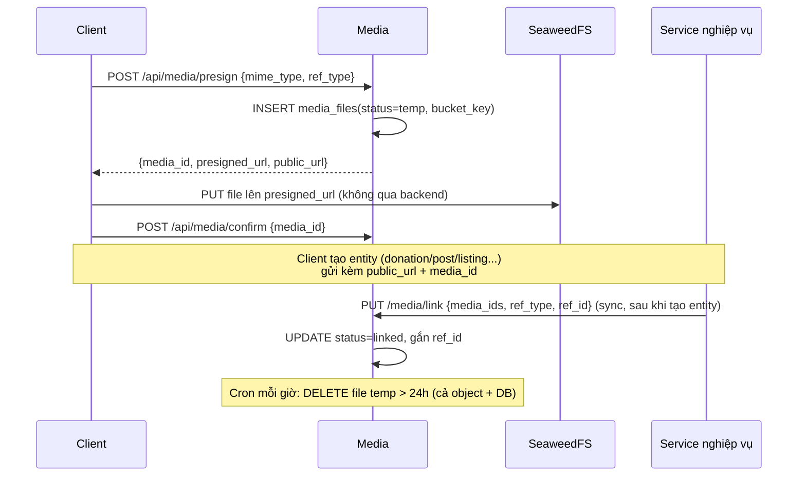
```mermaid
sequenceDiagram
    participant C as Client
    participant M as Media
    participant S as SeaweedFS
    participant X as Service nghiệp vụ
    C->>M: POST /api/media/presign {mime_type, ref_type}
    M->>M: INSERT media_files(status=temp, bucket_key)
    M-->>C: {media_id, presigned_url, public_url}
    C->>S: PUT file lên presigned_url (không qua backend)
    C->>M: POST /api/media/confirm {media_id}
    Note over C,X: Client tạo entity (donation/post/listing...)<br/>gửi kèm public_url + media_id
    X->>M: PUT /media/link {media_ids, ref_type, ref_id} (sync, sau khi tạo entity)
    M->>M: UPDATE status=linked, gắn ref_id
    Note over M: Cron mỗi giờ: DELETE file temp > 24h (cả object + DB)
```

#### Luồng 4: Tạo cuộc quyên góp + đóng góp (luồng lõi 1)

Nhóm tạo **cuộc quyên góp** (campaign) với mục tiêu cụ thể (vd: 15 áo, 15 bao gạo cho địa phương X). Donor đóng góp vào campaign.

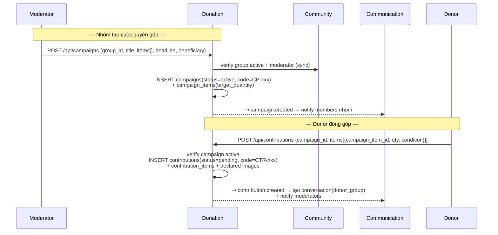
```mermaid
sequenceDiagram
    participant MOD as Moderator
    participant DON as Donation
    participant CM as Community
    participant COM as Communication
    participant D as Donor
    Note over MOD,DON: --- Nhóm tạo cuộc quyên góp ---
    MOD->>DON: POST /api/campaigns {group_id, title, items[], deadline, beneficiary}
    DON->>CM: verify group active + moderator (sync)
    DON->>DON: INSERT campaigns(status=active, code=CP-xxx)<br/>+ campaign_items(target_quantity)
    DON-->>COM: ⇢ campaign.created → notify members nhóm
    Note over D,DON: --- Donor đóng góp ---
    D->>DON: POST /api/contributions {campaign_id, items[{campaign_item_id, qty, condition}]}
    DON->>DON: verify campaign active<br/>INSERT contributions(status=pending, code=CTR-xxx)<br/>+ contribution_items + declared images
    DON-->>COM: ⇢ contribution.created → tạo conversation(donor_group)<br/>+ notify moderators
```

**Nhóm xử lý đóng góp — 3 bước trạng thái:**

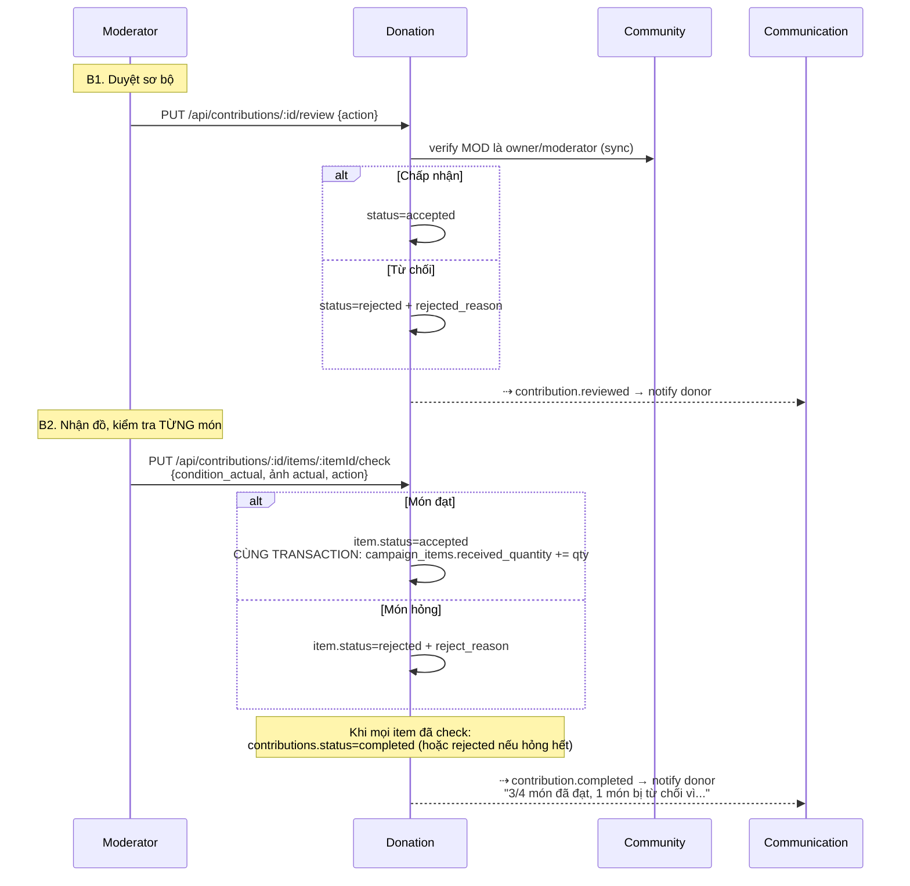
```mermaid
sequenceDiagram
    participant MOD as Moderator
    participant DON as Donation
    participant CM as Community
    participant COM as Communication
    Note over MOD: B1. Duyệt sơ bộ
    MOD->>DON: PUT /api/contributions/:id/review {action}
    DON->>CM: verify MOD là owner/moderator (sync)
    alt Chấp nhận
        DON->>DON: status=accepted
    else Từ chối
        DON->>DON: status=rejected + rejected_reason
    end
    DON-->>COM: ⇢ contribution.reviewed → notify donor
    Note over MOD: B2. Nhận đồ, kiểm tra TỪNG món
    MOD->>DON: PUT /api/contributions/:id/items/:itemId/check<br/>{condition_actual, ảnh actual, action}
    alt Món đạt
        DON->>DON: item.status=accepted<br/>CÙNG TRANSACTION: campaign_items.received_quantity += qty
    else Món hỏng
        DON->>DON: item.status=rejected + reject_reason
    end
    Note over DON: Khi mọi item đã check:<br/>contributions.status=completed (hoặc rejected nếu hỏng hết)
    DON-->>COM: ⇢ contribution.completed → notify donor<br/>"3/4 món đã đạt, 1 món bị từ chối vì..."
```

Điểm quan trọng: check → bump `received_quantity` là **một transaction nội bộ** Donation Service, không có rủi ro mất đồng bộ. Tiến độ campaign được update real-time.

#### Luồng 5: Trao tặng đợt quyên góp (luồng lõi 2)

Khi campaign đủ mục tiêu hoặc hết hạn, nhóm trao tặng toàn bộ đồ đến địa phương.

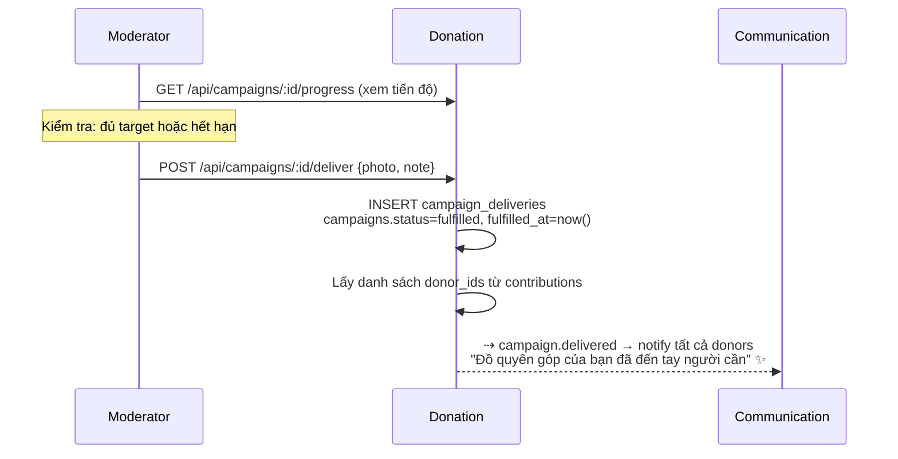
```mermaid
sequenceDiagram
    participant MOD as Moderator
    participant DON as Donation
    participant COM as Communication
    MOD->>DON: GET /api/campaigns/:id/progress (xem tiến độ)
    Note over MOD: Kiểm tra: đủ target hoặc hết hạn
    MOD->>DON: POST /api/campaigns/:id/deliver {photo, note}
    DON->>DON: INSERT campaign_deliveries<br/>campaigns.status=fulfilled, fulfilled_at=now()
    DON->>DON: Lấy danh sách donor_ids từ contributions
    DON-->>COM: ⇢ campaign.delivered → notify tất cả donors<br/>"Đồ quyên góp của bạn đã đến tay người cần" ✨
```

Trường hợp đóng campaign sớm (chưa đủ): `PUT /campaigns/:id/close` → status=closed, notify donors "đợt đã đóng".

#### Luồng 6: Theo dõi tiến độ đợt quyên góp (public)

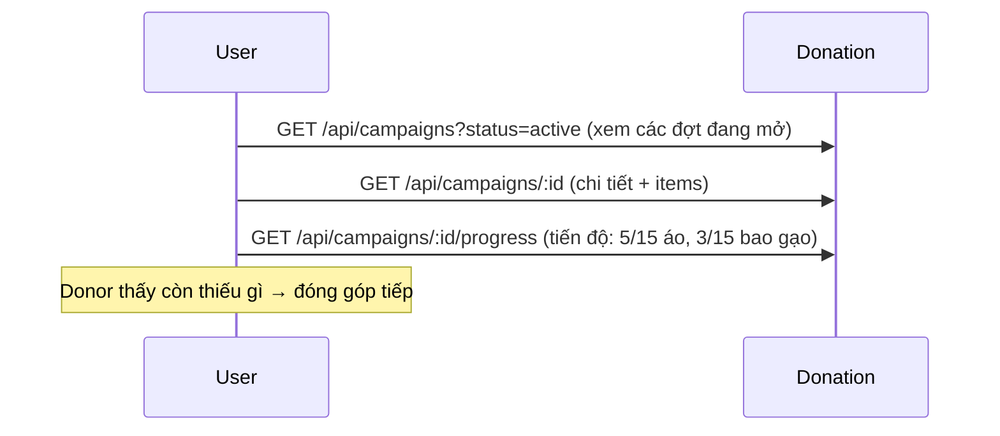
```mermaid
sequenceDiagram
    participant U as User
    participant DON as Donation
    U->>DON: GET /api/campaigns?status=active (xem các đợt đang mở)
    U->>DON: GET /api/campaigns/:id (chi tiết + items)
    U->>DON: GET /api/campaigns/:id/progress (tiến độ: 5/15 áo, 3/15 bao gạo)
    Note over U: Donor thấy còn thiếu gì → đóng góp tiếp
```

#### Luồng 7: Chat realtime (shared inbox phía nhóm)

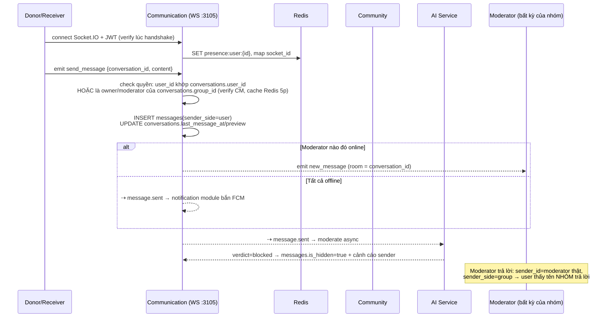
```mermaid
sequenceDiagram
    participant U as Donor/Receiver
    participant WS as Communication (WS :3105)
    participant RD as Redis
    participant CM as Community
    participant AI as AI Service
    participant MOD as Moderator (bất kỳ của nhóm)
    U->>WS: connect Socket.IO + JWT (verify lúc handshake)
    WS->>RD: SET presence:user:{id}, map socket_id
    U->>WS: emit send_message {conversation_id, content}
    WS->>WS: check quyền: user_id khớp conversations.user_id<br/>HOẶC là owner/moderator của conversations.group_id (verify CM, cache Redis 5p)
    WS->>WS: INSERT messages(sender_side=user)<br/>UPDATE conversations.last_message_at/preview
    alt Moderator nào đó online
        WS-->>MOD: emit new_message (room = conversation_id)
    else Tất cả offline
        WS-->>WS: ⇢ message.sent → notification module bắn FCM
    end
    WS-->>AI: ⇢ message.sent → moderate async
    AI-->>WS: verdict=blocked → messages.is_hidden=true + cảnh cáo sender
    Note over MOD: Moderator trả lời: sender_id=moderator thật,<br/>sender_side=group → user thấy tên NHÓM trả lời
```

#### Luồng 8: Đánh giá sau giao dịch

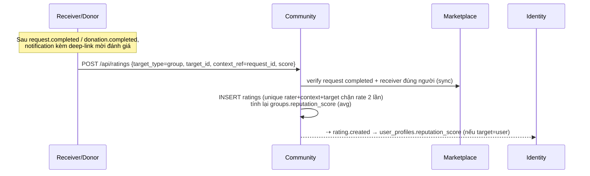
```mermaid
sequenceDiagram
    participant R as Receiver/Donor
    participant CM as Community
    participant MKT as Marketplace
    participant ID as Identity
    Note over R: Sau request.completed / donation.completed,<br/>notification kèm deep-link mời đánh giá
    R->>CM: POST /api/ratings {target_type=group, target_id, context_ref=request_id, score}
    CM->>MKT: verify request completed + receiver đúng người (sync)
    CM->>CM: INSERT ratings (unique rater+context+target chặn rate 2 lần)<br/>tính lại groups.reputation_score (avg)
    CM-->>ID: ⇢ rating.created → user_profiles.reputation_score (nếu target=user)
```

Chiều ngược lại: nhóm đánh giá donor (đồ đúng mô tả không) với `context_ref=donation_id`.

#### Luồng 9: Báo cáo vi phạm → xử lý

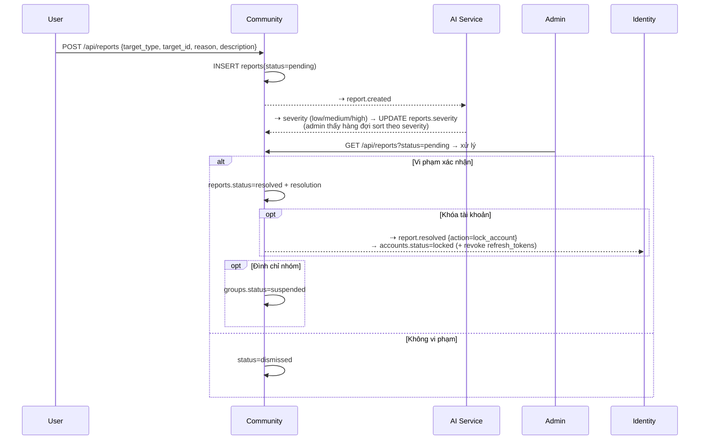
```mermaid
sequenceDiagram
    participant U as User
    participant CM as Community
    participant AI as AI Service
    participant AD as Admin
    participant ID as Identity
    U->>CM: POST /api/reports {target_type, target_id, reason, description}
    CM->>CM: INSERT reports(status=pending)
    CM-->>AI: ⇢ report.created
    AI-->>CM: ⇢ severity (low/medium/high) → UPDATE reports.severity<br/>(admin thấy hàng đợi sort theo severity)
    AD->>CM: GET /api/reports?status=pending → xử lý
    alt Vi phạm xác nhận
        CM->>CM: reports.status=resolved + resolution
        opt Khóa tài khoản
            CM-->>ID: ⇢ report.resolved {action=lock_account}<br/>→ accounts.status=locked (+ revoke refresh_tokens)
        end
        opt Đình chỉ nhóm
            CM->>CM: groups.status=suspended
        end
    else Không vi phạm
        CM->>CM: status=dismissed
    end
```

#### Luồng 10: Bài viết trong nhóm (feed)

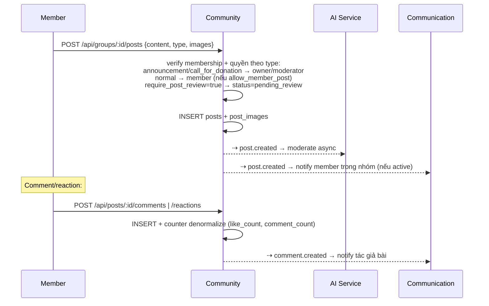
```mermaid
sequenceDiagram
    participant U as Member
    participant CM as Community
    participant AI as AI Service
    participant COM as Communication
    U->>CM: POST /api/groups/:id/posts {content, type, images}
    CM->>CM: verify membership + quyền theo type:<br/>announcement/call_for_donation → owner/moderator<br/>normal → member (nếu allow_member_post)<br/>require_post_review=true → status=pending_review
    CM->>CM: INSERT posts + post_images
    CM-->>AI: ⇢ post.created → moderate async
    CM-->>COM: ⇢ post.created → notify member trong nhóm (nếu active)
    Note over U: Comment/reaction:
    U->>CM: POST /api/posts/:id/comments | /reactions
    CM->>CM: INSERT + counter denormalize (like_count, comment_count)
    CM-->>COM: ⇢ comment.created → notify tác giả bài
```

#### Luồng 11: Notification + nhắc lịch (chạy ngầm)

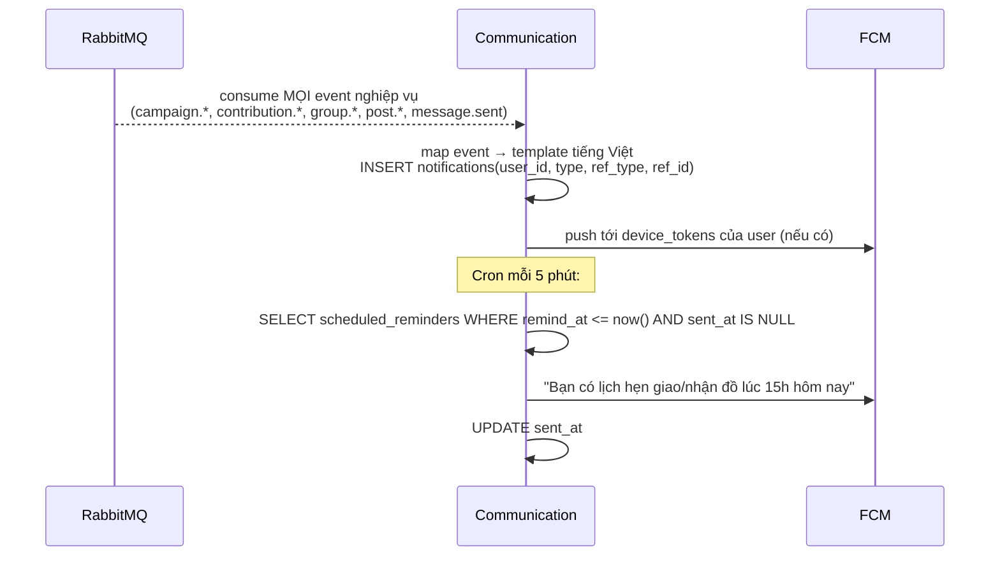
```mermaid
sequenceDiagram
    participant MQ as RabbitMQ
    participant COM as Communication
    participant FCM as FCM
    MQ-->>COM: consume MỌI event nghiệp vụ<br/>(campaign.*, contribution.*, group.*, post.*, message.sent)
    COM->>COM: map event → template tiếng Việt<br/>INSERT notifications(user_id, type, ref_type, ref_id)
    COM->>FCM: push tới device_tokens của user (nếu có)
    Note over COM: Cron mỗi 5 phút:
    COM->>COM: SELECT scheduled_reminders WHERE remind_at <= now() AND sent_at IS NULL
    COM->>FCM: "Bạn có lịch hẹn giao/nhận đồ lúc 15h hôm nay"
    COM->>COM: UPDATE sent_at
```

#### Luồng 12: Analytics (trong Donation Service)

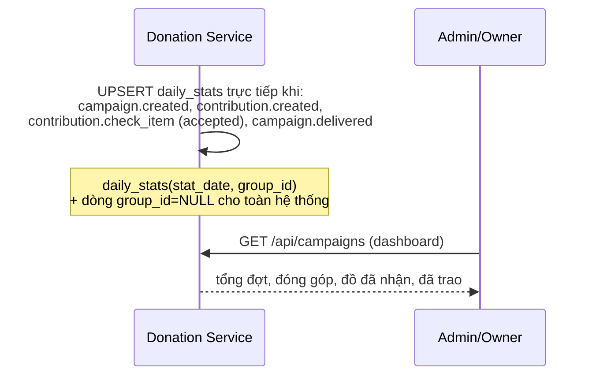
```mermaid
sequenceDiagram
    participant DON as Donation Service
    participant AD as Admin/Owner
    DON->>DON: UPSERT daily_stats trực tiếp khi:<br/>campaign.created, contribution.created,<br/>contribution.check_item (accepted), campaign.delivered
    Note over DON: daily_stats(stat_date, group_id)<br/>+ dòng group_id=NULL cho toàn hệ thống
    AD->>DON: GET /api/campaigns (dashboard)
    DON-->>AD: tổng đợt, đóng góp, đồ đã nhận, đã trao
```

#### Luồng 13: Theo dõi tiến độ đóng góp (minh bạch cho donor)

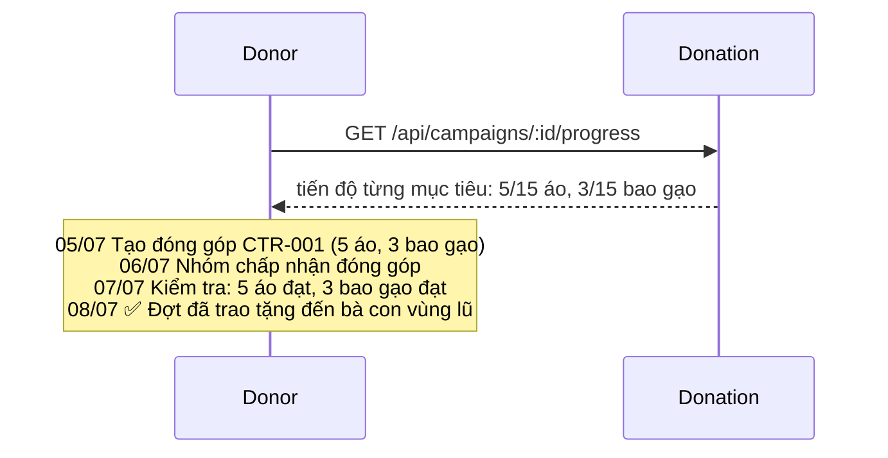
```mermaid
sequenceDiagram
    participant D as Donor
    participant DON as Donation
    D->>DON: GET /api/campaigns/:id/progress
    DON-->>D: tiến độ từng mục tiêu: 5/15 áo, 3/15 bao gạo
    Note over D: 05/07 Tạo đóng góp CTR-001 (5 áo, 3 bao gạo)<br/>06/07 Nhóm chấp nhận đóng góp<br/>07/07 Kiểm tra: 5 áo đạt, 3 bao gạo đạt<br/>08/07 ✅ Đợt đã trao tặng đến bà con vùng lũ
```

#### Bảng tổng hợp chuỗi trạng thái xuyên suốt

```text
CAMPAIGN:      active → fulfilled (hoặc closed/cancelled)
CONTRIBUTION:  pending → accepted → received → completed (hoặc rejected/cancelled)
ITEM:          pending → accepted | rejected  (accepted → bump campaign_item.received_quantity)

Event (RabbitMQ):   mọi thay đổi trạng thái → Communication (notify + reminder)
                     post.created → AI (moderation)
```
