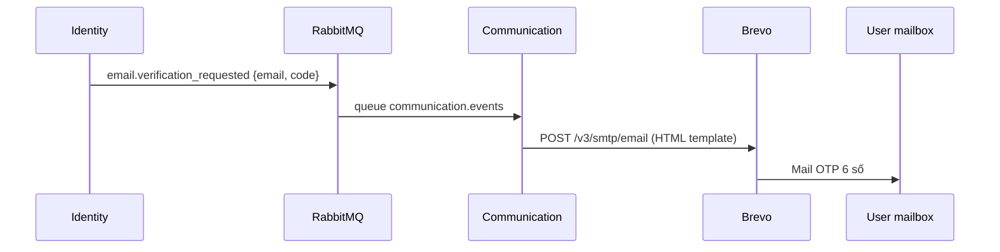

# Communication Service

| | |
|---|---|
| **Mục đích** | Kênh giao tiếp & thông báo: email transactional, push FCM, chat realtime, in-app notification, nhắc lịch |
| **Stack** | Python 3.12 · FastAPI · python-socketio · asyncpg · aio-pika · Brevo · Firebase Admin |
| **Port** | `3005` |
| **Gateway** | `/api/communication` |
| **Database** | `communication_db` |
| **Code** | `apps/communication-service/` |
| **Schema** | `infra/postgres/init/02-communication-schema.sql` |
| **ASGI** | `app.main:asgi_app` (Socket.IO mount trên FastAPI) |

---

## Service này làm gì?

Communication là **hub side-effect** của platform: các service nghiệp vụ **không** gửi email/push trực tiếp mà publish RabbitMQ; Communication consume và thực thi.

| Có trách nhiệm | Không làm |
|---|---|
| Email Brevo (verify, reset pass, thông báo) | Lưu account / password |
| Push FCM (device tokens) | Business approve donation/group |
| Chat Socket.IO + REST lịch sử | Upload media |
| In-app notifications | |
| Scheduled reminders (lịch hẹn) | |

---

## Các kênh

### 1) Email (Brevo)

| Event / trigger | Subject / nội dung |
|---|---|
| `email.verification_requested` | **Mã xác minh email** (OTP 6 số) |
| `email.verified` | **Tài khoản đã sẵn sàng** |
| `password.reset_requested` | **Mã đặt lại mật khẩu** (OTP 6 số) |
| `password.reset_completed` | **Mật khẩu đã được thay đổi** |

Thiếu `BREVO_API_KEY` → dry-run (chỉ log).

### 2) Push (FCM)

- Đăng ký device: REST `/devices/tokens`
- Gửi khi có notification / message (nếu FCM config đủ)

### 3) Chat realtime (Socket.IO)

| | |
|---|---|
| Path direct | `/socket.io` |
| Path qua Kong | `/api/communication/socket.io` |
| Auth | JWT trong handshake `auth.token` |

Dùng cho hội thoại donor↔group / receiver↔group (tạo conversation khi có donation/request — phụ thuộc event từ Donation/Marketplace).

### 4) In-app notification

Bảng `notifications`: list, đánh dấu đã đọc.

---

## API REST (cần JWT trừ health)

### Notifications

| Method | Path | Mô tả |
|---|---|---|
| GET | `/notifications` | Danh sách |
| PATCH | `/notifications/{id}/read` | Đánh dấu 1 |
| POST | `/notifications/read-all` | Đánh dấu tất cả |

### Devices

| Method | Path | Mô tả |
|---|---|---|
| POST | `/devices/tokens` | Đăng ký FCM token |
| DELETE | `/devices/tokens` | Gỡ token |

### Conversations

| Method | Path | Mô tả |
|---|---|---|
| GET | `/conversations` | Inbox |
| GET | `/conversations/{id}/messages` | Lịch sử |
| POST | `/conversations/{id}/messages` | Gửi tin (REST) |
| POST | `/conversations/{id}/read` | Đánh dấu đã đọc |

---

## Luồng email (ví dụ verify)



## Luồng chat (khái quát)

```text
Donation/Marketplace tạo context
  → event donation.created / request.approved
  → Communication ensure conversation + system message
  → User/moderator nhắn qua Socket.IO hoặc REST
  → message.sent → push recipients (optional)
```

---

## Events consume (chính)

| Event | Hành vi |
|---|---|
| `email.verification_requested` | Email OTP verify |
| `email.verified` | Email chào mừng |
| `password.reset_requested` | Email OTP reset |
| `password.reset_completed` | Email đổi pass thành công |
| `group.approved` / `join_requested` / `member_approved` | Notify |
| `donation.*` / `request.*` | Conversation + notify + reminder |
| `listing.created` | Notify members |
| `message.sent` | Push chat |

Queue: `communication.events` · bind routing key `#` trên exchange `charity.events`.

---

## Env quan trọng

| Biến | Mục đích |
|---|---|
| `BREVO_API_KEY` / `BREVO_SENDER_*` | Email |
| `FCM_PROJECT_ID` / `FCM_CLIENT_EMAIL` / `FCM_PRIVATE_KEY` | Push |
| `FRONTEND_BASE_URL` | Link trong mail (login…) |
| `RABBITMQ_URL` | Consumer |
| `JWT_SECRET` | Auth REST + Socket |
