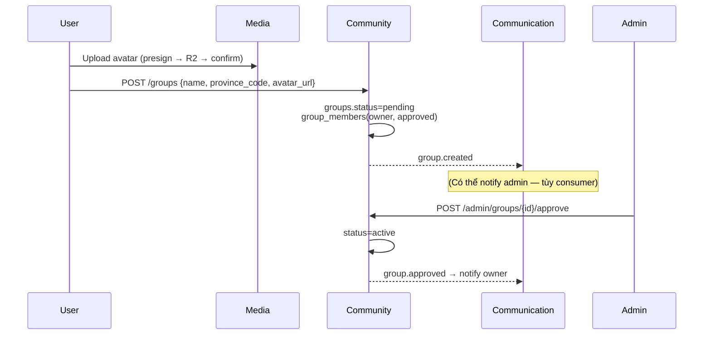
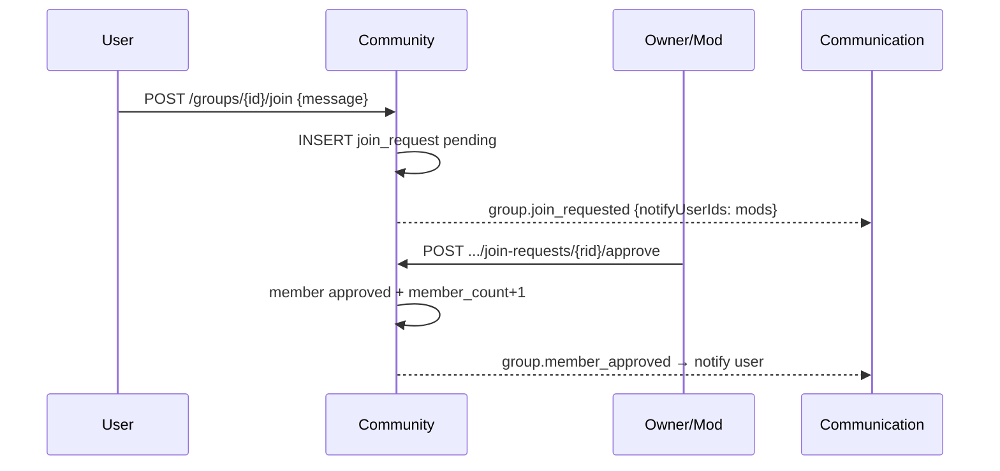

# Community Service

| | |
|---|---|
| **Mục đích** | Không gian xã hội của hội nhóm: tạo/duyệt nhóm, thành viên, join request, bài viết, bình luận, like |
| **Stack** | Python 3.12 · FastAPI · asyncpg · PyJWT · aio-pika |
| **Port** | `3002` |
| **Gateway** | `/api/community` |
| **Database** | `community_db` |
| **Code** | `apps/community-service/` |
| **Schema** | `infra/postgres/init/03-community-schema.sql` |

---

## Service này làm gì?

Community quản lý **hội nhóm thiện nguyện** như “tổ chức trung gian” trong mô hình Gian hàng 0 đồng.

| Có trách nhiệm | Không làm |
|---|---|
| CRUD nhóm (tạo pending, admin duyệt active) | Auth / JWT cấp phát (→ Identity) |
| Thành viên + join request | Upload ảnh (client → Media, chỉ lưu URL) |
| Bài viết, ảnh bài viết, comment, reaction | Quyên góp / kho (→ Donation) |
| Phân quyền **trong nhóm**: owner / moderator / member | Gian hàng 0 đồng (→ Marketplace) |
| Publish event cho Communication thông báo | Gửi email/push trực tiếp |

---

## Vai trò trong nhóm

| Role | Quyền chính |
|---|---|
| **owner** | Toàn quyền nhóm; đổi role moderator; không bị kick |
| **moderator** | Duyệt join, sửa nhóm, pin/ẩn bài, duyệt bài (nếu bật review) |
| **member** | Xem feed, đăng bài (nếu `allow_member_post`), comment, like |
| **PLATFORM_ADMIN** (JWT Identity) | Duyệt/suspend nhóm toàn hệ thống |

---

## Trạng thái nhóm

| Status | Ý nghĩa |
|---|---|
| `pending` | Mới tạo, chờ admin duyệt — public list **không** hiện |
| `active` | Hoạt động bình thường |
| `suspended` | Bị tạm dừng |
| `closed` | Đóng |

---

## API (sau strip `/api/community`)

### Nhóm

| Method | Path | Auth | Mô tả |
|---|---|---|---|
| POST | `/groups` | JWT | Tạo nhóm (`pending`) + owner member |
| GET | `/groups` | Optional | Catalog public (mặc định chỉ `active`) — **không** lọc membership |
| GET | `/groups/me` | JWT | **Nhóm user đã tham gia** (+ `my_role`, `my_status`) |
| GET | `/groups/{id}` | Optional | Chi tiết (pending: owner/member/admin) |
| PATCH | `/groups/{id}` | JWT mod+ | Cập nhật thông tin nhóm |
| POST | `/admin/groups/{id}/approve` | Admin | Duyệt → `active` |
| POST | `/admin/groups/{id}/suspend` | Admin | Suspend |

### Thành viên & join

| Method | Path | Auth | Mô tả |
|---|---|---|---|
| POST | `/groups/{id}/join` | JWT | Xin tham gia (`message?`) |
| GET | `/groups/{id}/join-requests` | Mod+ | Danh sách request |
| POST | `.../join-requests/{rid}/approve` | Mod+ | Duyệt → member |
| POST | `.../join-requests/{rid}/reject` | Mod+ | Từ chối |
| GET | `/groups/{id}/members` | Optional | List members |
| PUT | `.../members/{uid}/role` | Owner | Đổi role (`moderator`/`member`) |
| PUT | `.../members/{uid}/status` | Mod+ | ban / left / approved |

### Bài viết

| Method | Path | Auth | Mô tả |
|---|---|---|---|
| POST | `/groups/{id}/posts` | JWT member | Tạo bài (+ `image_urls[]`) |
| GET | `/groups/{id}/posts` | Optional | Feed (pinned trước) |
| GET | `/posts/{id}` | Optional | Chi tiết |
| PATCH | `/posts/{id}` | Author / mod | Sửa content, pin, ẩn |
| POST | `/posts/{id}/comments` | Member | Bình luận |
| GET | `/posts/{id}/comments` | Public | List comment |
| POST | `/posts/{id}/reactions` | Member | Like |
| DELETE | `/posts/{id}/reactions` | Member | Bỏ like |

---

## Luồng chi tiết

### 1) Tạo nhóm & admin duyệt



### 2) Xin tham gia & duyệt



### 3) Đăng bài

```text
Member (hoặc mod) POST /groups/{id}/posts
  → Nếu require_post_review && không phải mod: status=pending_review
  → Ngược lại: status=active + event post.created
  → image_urls chỉ là URL public từ Media (không upload qua Community)
```

---

## Sự kiện publish

| Event | Khi nào |
|---|---|
| `group.created` | Tạo nhóm |
| `group.approved` | Admin duyệt |
| `group.join_requested` | Có người xin join |
| `group.member_approved` | Duyệt join |
| `post.created` | Bài active mới |

---

## Phụ thuộc

- **Identity**: JWT hợp lệ, role `PLATFORM_ADMIN` để approve group.
- **Media**: client tự upload; Community chỉ lưu `avatar_url` / `image_urls`.
- **Communication**: nhận event → notify/email/push.

## Chưa implement (schema đã có sẵn)

- Ratings / Reports đầy đủ API  
- Full-text search GIN nâng cao  
- Liên kết media `link` tự động khi tạo post  
