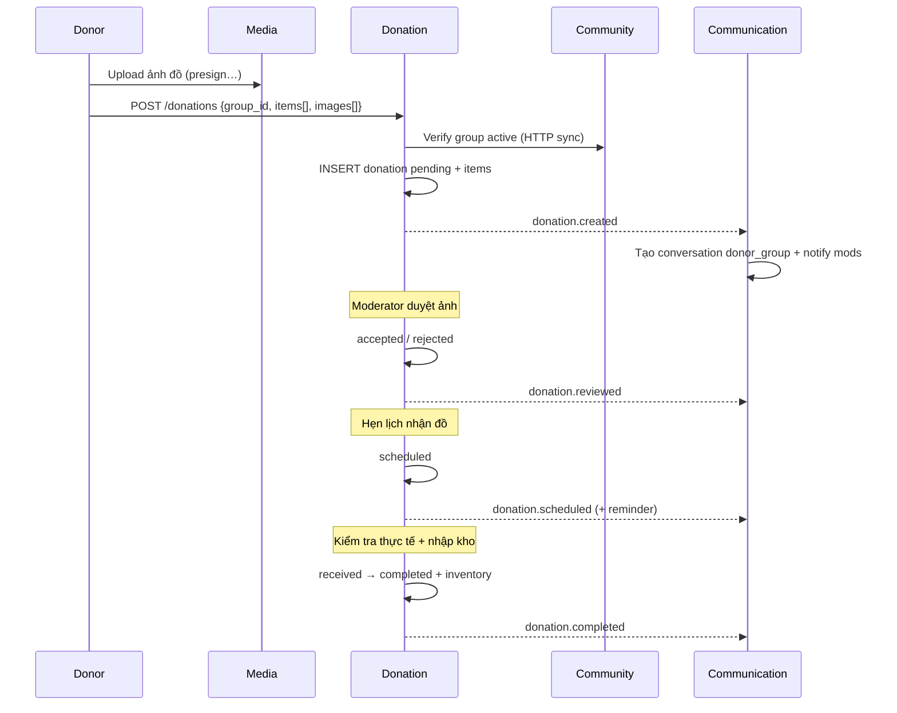

# Donation Service

| | |
|---|---|
| **Mục đích** | Quy trình quyên góp lõi: donor đăng ký cho đồ → nhóm duyệt → hẹn lịch → kiểm tra thực tế → nhập kho + hành trình món đồ |
| **Stack dự kiến** | FastAPI hoặc NestJS (theo chuẩn platform) |
| **Port** | `3003` |
| **Gateway** | `/api/donation` |
| **Database** | `donation_db` |
| **Code** | `apps/donation-service/` — **chưa implement** |
| **Schema** | Mô tả trong `docs/database.md` (donation_db) |

---

## Service này sẽ làm gì?

Donation là **luồng nghiệp vụ lõi #1** của nền tảng.

| Có trách nhiệm (thiết kế) | Không làm |
|---|---|
| Tạo donation + items + ảnh khai báo | Auth (Identity) |
| Moderator duyệt / từ chối / hẹn lịch | Upload file (Media) |
| Kiểm tra thực tế (actual images) | Gian hàng listing (Marketplace) |
| Import kho / inventory | Chat (Communication qua event) |
| Timeline hành trình món đồ | |
| Event cho Communication (notify, chat room) | |

**Quy tắc đã chốt:** Donor **không bắt buộc** là member của nhóm.

---

## Trạng thái donation (thiết kế)

```text
pending → accepted → scheduled → received → completed
                 ↘ rejected
                 ↘ cancelled
```

---

## Luồng nghiệp vụ dự kiến



---

## Events sẽ publish

| Event | Ý nghĩa |
|---|---|
| `donation.created` | Đơn mới |
| `donation.reviewed` | Duyệt / từ chối |
| `donation.scheduled` | Hẹn lịch |
| `donation.completed` | Hoàn tất + nhập kho |
| `inventory.imported` | Item vào kho |

---

## API dự kiến (chưa có code)

- `POST /donations`
- `GET /donations`, `GET /donations/{id}`
- `PUT /donations/{id}/review`
- `PUT /donations/{id}/schedule`
- `PUT /donations/{id}/receive` (check-in thực tế)
- `GET /donations/{id}/timeline`

Chi tiết sequence hiện có trong [flows.md](../flows.md) (Luồng 4).

## Việc cần làm khi implement

1. Scaffold service + Dockerfile + schema SQL init  
2. Repositories donation / items / images / inventory  
3. HTTP client gọi Community (group active)  
4. Publish events khớp `libs/events`  
5. Route Kong đã có sẵn (`/api/donation`) — hiện 502 nếu gọi  
