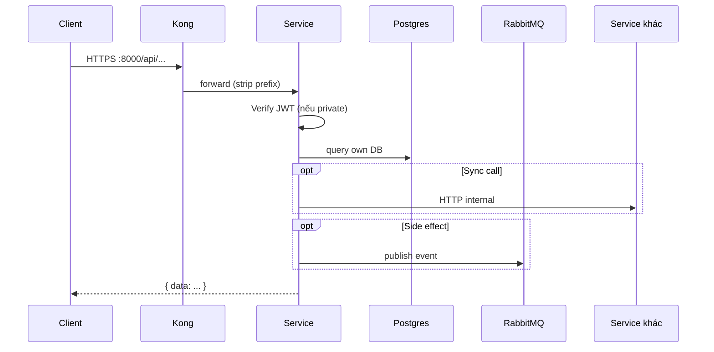

# Gateway & Hạ tầng

Tài liệu các thành phần **không phải business domain** nhưng bắt buộc để hệ thống chạy.

---

## 1. Kong API Gateway

| | |
|---|---|
| **Mục đích** | Cổng vào duy nhất: routing, CORS, (JWT plugin nếu bật), rate-limit, gom OpenAPI |
| **Image** | `kong:3.8` (DB-less) |
| **Port** | `8000` proxy · `8001` admin |
| **Config** | `infra/kong/kong.yml` |

### Route map

| Path prefix | Upstream |
|---|---|
| `/api/identity` | identity-service:3001 |
| `/api/community` | community-service:3002 |
| `/api/donation` | donation-service:3003 |
| `/api/marketplace` | marketplace-service:3004 |
| `/api/communication` | communication-service:3005 |
| `/api/media` | media-service:3006 |
| `/api/ai` | ai-service:3007 |
| `/docs` | docs-portal:8080 |

`strip_path: true` → service nhận path **không** còn prefix `/api/...`.

---

## 2. PostgreSQL

| | |
|---|---|
| **Mục đích** | Lưu trữ bền vững, **một database mỗi service** |
| **Image** | `postgres:16-alpine` |
| **Init** | `infra/postgres/init/` |

| File | Nội dung |
|---|---|
| `01-create-databases.sql` | Tạo `identity_db`, `community_db`, … |
| `02-communication-schema.sql` | Bảng chat, notify, devices, reminders |
| `03-community-schema.sql` | Groups, posts, members… |

> Volume cũ: script init **không chạy lại**. Cần `psql` migrate tay khi thêm schema.

---

## 3. Redis

| | |
|---|---|
| **Mục đích** | Cache / presence / rate (dùng dần theo service) |
| **Image** | `redis:7-alpine` |
| **Port** | `6379` |

---

## 4. RabbitMQ

| | |
|---|---|
| **Mục đích** | Message bus bất đồng bộ giữa service |
| **Image** | `rabbitmq:3-management-alpine` |
| **AMQP** | `5672` |
| **UI** | `15672` |
| **Definitions** | `infra/rabbitmq/definitions.json` |

- Exchange topic: **`charity.events`**
- Queue ví dụ: `communication.events` (bind `#`)
- Payload: JSON camelCase theo `libs/events`

### Pattern

```text
Service A (publish, best-effort)
    → exchange charity.events (routing key = event name)
        → queue(s) bound
            → Service B consumer
```

Identity / Community publish **không fail request** nếu broker down (log + drop).  
Communication **retry** connect consumer.

---

## 5. Docs portal

| | |
|---|---|
| **Mục đích** | Swagger UI multi-spec |
| **Path** | `http://host:8000/docs` |
| **Config** | `infra/docs-portal/swagger-config.json` |

---

## 6. Cloudflare R2 (ngoài Docker)

Dùng bởi **Media** (và CDN public). Không chạy trong compose.

---

## Luồng request điển hình


