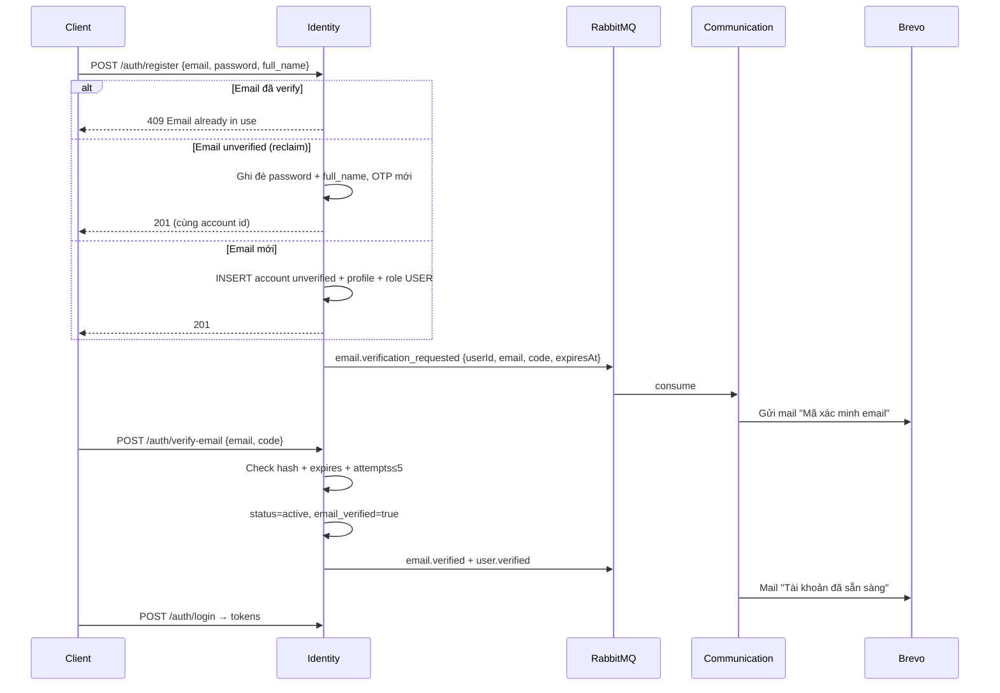
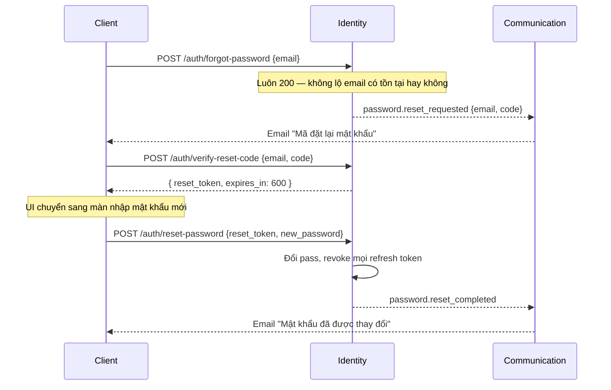

# Identity Service

| | |
|---|---|
| **Mục đích** | Định danh & bảo mật: tài khoản, xác thực, phiên JWT, hồ sơ người dùng, 2FA, quản trị khóa/mở tài khoản |
| **Stack** | Python 3.12 · FastAPI · asyncpg · PyJWT · passlib/bcrypt · aio-pika |
| **Port** | `3001` |
| **Gateway** | `/api/identity` |
| **Database** | `identity_db` |
| **Code** | `apps/identity-service/` |

---

## Service này làm gì?

Identity là **nguồn sự thật duy nhất** về “ai đang đăng nhập” và thông tin hồ sơ cơ bản.

| Có trách nhiệm | Không làm |
|---|---|
| Đăng ký / verify email / login / logout / refresh | Quản lý hội nhóm (→ Community) |
| Cấp access + refresh JWT | Upload file (→ Media) |
| Quên mật khẩu (OTP 6 số) | Gửi email trực tiếp (publish event → Communication) |
| Hồ sơ user (profile) | Chat, push |
| 2FA TOTP | Quyên góp / gian hàng |
| Role hệ thống: `USER`, `PLATFORM_ADMIN` | Role trong nhóm (`owner/moderator/member`) |

---

## Khái niệm chính

### Account status

| Status | Ý nghĩa |
|---|---|
| `unverified` | Mới đăng ký, chưa xác minh email → **không login được** |
| `active` | Đã verify, dùng bình thường |
| `locked` | Bị admin khóa |

### Token

| Loại | TTL mặc định | Dùng cho |
|---|---|---|
| Access JWT | 15 phút | Gọi API private (`Authorization: Bearer …`) |
| Refresh | 7 ngày | Đổi access mới (rotate) |
| OTP 6 số (verify email) | 24h | Xác minh email |
| OTP 6 số (reset password) | 1h | Quên mật khẩu |
| `password_reset` JWT | 10 phút | Sau khi check OTP, cho phép đặt pass mới |
| `2fa_challenge` JWT | 5 phút | Bước 1 login khi bật TOTP |

JWT claims quan trọng: `sub` (user id), `roles`, `iss=charity-auth`, `type`, `email` (optional).

---

## API (sau khi Kong strip prefix)

### Auth — công khai

| Method | Path | Body | Mô tả |
|---|---|---|---|
| POST | `/auth/register` | `email?`, `phone?`, `password`, `full_name` | Tạo account unverified + OTP email |
| POST | `/auth/verify-email` | `email`, `code` | Xác minh OTP 6 số |
| POST | `/auth/resend-verification` | `email` | Gửi lại OTP (luôn 200) |
| POST | `/auth/login` | `email?` \| `phone?`, `password`, `device_info?` | Đăng nhập |
| POST | `/auth/login/2fa` | `challenge_token`, `code`, `device_info?` | Hoàn tất 2FA |
| POST | `/auth/refresh` | `refresh_token`, `device_info?` | Đổi token |
| POST | `/auth/logout` | `refresh_token` | Thu hồi refresh |
| POST | `/auth/forgot-password` | `email` | Gửi OTP đặt lại MK |
| POST | `/auth/verify-reset-code` | `email`, `code` | Check OTP → `reset_token` |
| POST | `/auth/reset-password` | `reset_token` + `new_password` (hoặc `email`+`code`+`new_password`) | Đặt MK mới |

### Profile — cần JWT

| Method | Path | Mô tả |
|---|---|---|
| GET | `/profile/me` | Hồ sơ private |
| PUT | `/profile/me` | Cập nhật hồ sơ |
| GET | `/profile/me/activities` | Log hoạt động |
| GET | `/profile/{account_id}` | Hồ sơ public |

### 2FA — cần JWT

| Method | Path | Mô tả |
|---|---|---|
| POST | `/2fa/setup` | Tạo secret + QR |
| POST | `/2fa/enable` | Bật 2FA (xác nhận code) |
| POST | `/2fa/disable` | Tắt 2FA |

### Admin accounts — JWT + PLATFORM_ADMIN

| Method | Path | Mô tả |
|---|---|---|
| GET | `/accounts` | Danh sách account |
| POST | `/accounts/{id}/lock` | Khóa |
| POST | `/accounts/{id}/unlock` | Mở khóa |

---

## Luồng chi tiết

### 1) Đăng ký + xác minh email



**Quy tắc reclaim:** người khác “giữ chỗ” email unverified → chủ email đăng ký lại **ghi đè** password (không 409).

### 2) Đăng nhập

```text
POST /auth/login { email|phone, password, device_info? }
  → 401 nếu sai credentials
  → 403 nếu unverified / locked / suspended
  → 200 { two_factor_required, challenge_token } nếu bật TOTP
  → 200 { access_token, refresh_token, token_type, expires_in } nếu OK
```

### 3) Quên mật khẩu (3 bước)



### 4) Refresh / Logout

```text
refresh: verify hash refresh_token → revoke cũ → cấp cặp token mới
logout:  revoke refresh_token hiện tại
```

---

## Sự kiện publish (RabbitMQ)

| Event | Khi nào | Payload chính |
|---|---|---|
| `user.registered` | Tạo account lần đầu (không reclaim) | userId, email, fullName |
| `email.verification_requested` | Cấp OTP verify | userId, email, **code**, expiresAt |
| `email.verified` | Verify email thành công | userId, email |
| `user.verified` | Verify email thành công | userId |
| `password.reset_requested` | Forgot password | userId, email, **code**, expiresAt |
| `password.reset_completed` | Đổi pass xong | userId, email |

---

## Client cần nhớ

1. Sau register → màn nhập **mã 6 số** (không còn link token).
2. Login chỉ khi `email_verified` / status active.
3. Mọi API private: header `Authorization: Bearer <access_token>`.
4. Hết hạn access → `POST /auth/refresh`.
