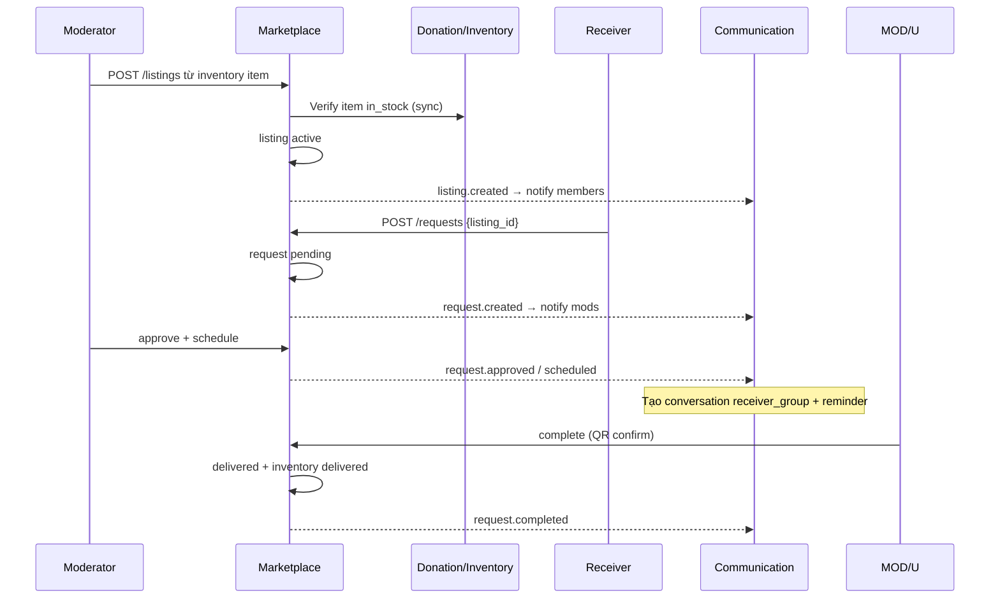

# Marketplace Service

| | |
|---|---|
| **Mục đích** | Gian hàng 0 đồng: đăng listing từ kho, người cần đăng ký nhận, nhóm duyệt, hẹn lịch, trao tặng (QR), thống kê |
| **Stack dự kiến** | FastAPI hoặc NestJS |
| **Port** | `3004` |
| **Gateway** | `/api/marketplace` |
| **Database** | `marketplace_db` |
| **Code** | `apps/marketplace-service/` — **chưa implement** |
| **Schema** | `docs/database.md` (marketplace_db) |

---

## Service này sẽ làm gì?

Marketplace là **luồng nghiệp vụ lõi #2**: sau khi đồ đã vào kho (Donation), nhóm đưa lên gian hàng để người cần nhận.

| Có trách nhiệm (thiết kế) | Không làm |
|---|---|
| Listing (per-group + catalog toàn hệ thống) | Auth |
| Request nhận đồ | Quyên góp / kiểm tra kho (Donation) |
| Duyệt request, schedule, complete (QR) | Upload (Media) |
| Tìm kiếm theo category / địa điểm | Hội nhóm membership (đọc Community) |
| Event notify | |

**Quy tắc:** Người nhận thường cần là **member đã duyệt** của nhóm (theo flows thiết kế).

---

## Luồng nghiệp vụ dự kiến

---

## Events sẽ publish

| Event | Ý nghĩa |
|---|---|
| `listing.created` | Đồ mới trên gian hàng |
| `request.created` | Có người xin nhận |
| `request.approved` | Duyệt nhận |
| `request.scheduled` | Hẹn trao |
| `request.completed` | Đã trao |

---

## API dự kiến (chưa code)

- `POST/GET /listings`, `GET /listings/{id}`
- `GET /catalog` (toàn hệ thống)
- `POST /requests`, `GET /requests`
- `PUT /requests/{id}/approve|reject|schedule|complete`
- Thống kê theo group / platform

Route Kong `/api/marketplace` đã khai báo — gọi hiện tại sẽ **502**.

Xem thêm [flows.md](../flows.md) các luồng nhận đồ / QR.
