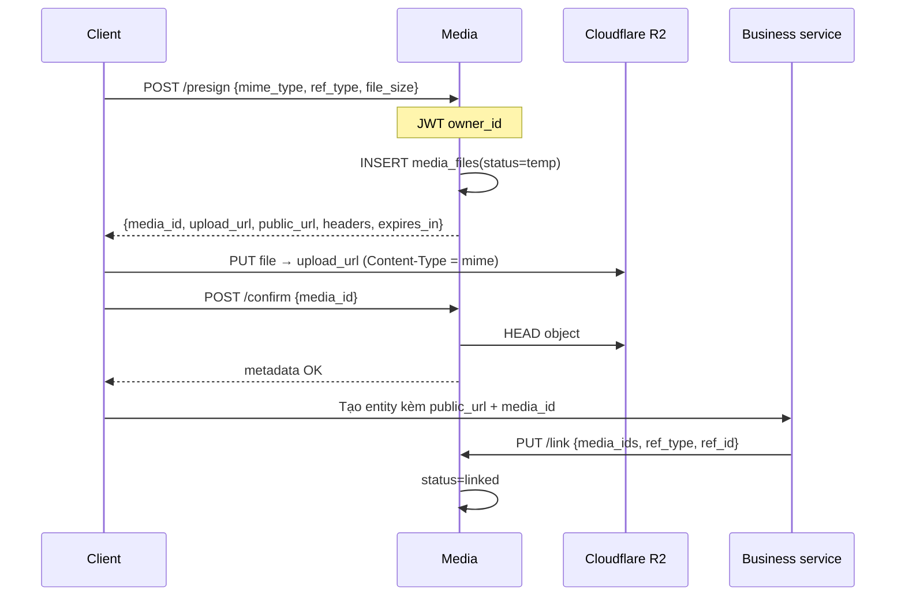

# Media Service

| | |
|---|---|
| **Mục đích** | Quản lý upload file an toàn: cấp URL tạm (presigned) lên Cloudflare R2, xác nhận file, gắn media với entity nghiệp vụ |
| **Stack** | Python 3.12 · FastAPI · asyncpg · boto3 (S3 API R2) · PyJWT |
| **Port** | `3006` |
| **Gateway** | `/api/media` |
| **Database** | `media_db` |
| **Code** | `apps/media-service/` |

---

## Service này làm gì?

Media **không** nhận file multipart qua backend. Client upload **trực tiếp** lên R2 bằng URL đã ký.

| Có trách nhiệm | Không làm |
|---|---|
| Presign PUT URL (TTL ngắn) | Auth đăng ký/login |
| Lưu metadata `media_files` | Resize / AI (→ AI) |
| Confirm file đã lên R2 | Business entity (post, donation…) |
| Link / unlink `ref_type` + `ref_id` | Serve ảnh public (CDN R2) |
| Cleanup file `temp` quá hạn | |

---

## Lifecycle media

| Status | Ý nghĩa |
|---|---|
| `temp` | Đã presign (có thể chưa upload); chờ confirm/link |
| `linked` | Đã gắn entity nghiệp vụ |
| `deleted` | Đã xóa / dọn |

**Object key** (server sinh, không tin client filename):

```text
{folder}/{YYYY}/{MM}/{DD}/{HH}/{mm}/{uuid}.{ext}
# folder theo ref_type: avatars, posts, donations, listings, chat, delivery
```

**Public URL:**

```text
{R2_PUBLIC_BASE_URL}/{object_key}
# ví dụ https://cdn-img.example.com/avatars/2026/07/10/10/01/uuid.jpg
```

---

## API (cần JWT trừ health)

| Method | Path | Body | Mô tả |
|---|---|---|---|
| POST | `/presign` | `mime_type`, `ref_type`, `file_size` | Tạo record temp + `upload_url` |
| POST | `/confirm` | `media_id` | HEAD R2 — file đã tồn tại? |
| PUT | `/link` | `media_ids[]`, `ref_type`, `ref_id` | Gắn entity (gọi sau khi tạo post/donation…) |
| PUT | `/unlink` | `media_ids[]` | Gỡ gắn (owner) |
| GET | `/{media_id}` | — | Metadata (owner hoặc admin) |

### `mime_type` cho phép

`image/jpeg` · `image/png` · `image/webp`

### `ref_type` cho phép

`donation` · `listing` · `post` · `avatar` · `chat` · `delivery`

---

## Luồng upload chuẩn



### Cleanup

- Cron trong process: file `temp` quá `TEMP_TTL_HOURS` (mặc định 24h) → xóa R2 + DB.

---

## Cấu hình R2 (env)

| Biến | Ý nghĩa |
|---|---|
| `R2_ACCOUNT_ID` | ~32 hex (endpoint = `https://{id}.r2.cloudflarestorage.com`) |
| `R2_ACCESS_KEY_ID` | API token access key |
| `R2_SECRET_ACCESS_KEY` | Secret (bắt buộc để ký URL) |
| `R2_BUCKET` | Tên bucket |
| `R2_PUBLIC_BASE_URL` | CDN / custom domain |

---

## Bảo mật

- Chỉ **owner** (JWT `sub`) confirm/link/unlink media của mình.
- Admin (`PLATFORM_ADMIN`) có thể đọc media bất kỳ.
- Presign TTL ngắn (`presign_expires_seconds`, mặc định 300s).
- Giới hạn kích thước (`max_file_size_bytes`, mặc định 5MB).
